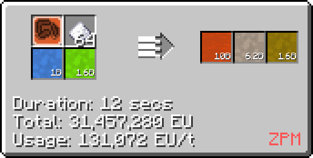

# Acetic Acid

Acetic acid can be made as early on as <LV>**LV**</LV> and is used in a variety of lines and recipes. Notably, it's used in the production of [Polyvynil Butyral](/StarT-Wiki/Chemical-Lines/Plastics/Polyvinyl-Butyral/) and later on the production of polyimide.

## Making Acetic Acid with Distillation

Acetic acid is most directly obtained from distilling fermented biomass or wood vinegar in a minimum <HV>**HV**</HV> distillation tower.

 

It can also be obtained from an <MV>**MV**</MV> distillery also using fermented biomass or wood vinegar.

## Making Acetic Acid with Chemical Reactors

Acetic Acid can also be made in a large / regular chemical reactor by reacting its constituent elements (hydrogen, oxygen, and carbon) on circuit 4.

It can also be made by reacting ethylene and oxygen on circuit 2, hydrogen and carbon monoxide on circuit 2, or methanol and carbon monoxide on any circuit.

  

The latter recipes are faster, but do require that you have the reagents on hand or passived somewhere else.

## Late game / Alternate Sources

Lastly, in the later game it can be obtained from bacterial harvesting, requiring a <ZPM>**ZPM**</ZPM> Bacterial Hydrocarbon Harvester.

There are a couple more recipes for making acetic acid with chemical reactors, though they are not as useful as the ones previously described:

- Reacting acetic anhydride and aminophenol.
- Reacting methyl acetate, water, and sodium hydroxide (sodium hydroxide is not consumed, requires <MV>**MV**</MV>).

<small><small>By: humanoferth</small></small>