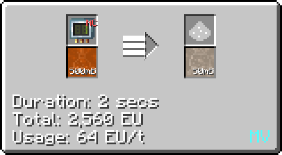

# Acetic Acid

Acetic acid can be made as early on as <LV>**LV**</LV> and is used in a variety of lines and recipes. Notably, it's used in the production of polyvynil butyral and later on the production of polyimide.

## Making Acetic Acid

Acetic acid is most directly obtained from distilling fermented biomass or wood vinegar in a minimum <MV>**HV**</MV> distillation tower.

 

It can also be obtained from an <MV>**MV**</MV> distillery also using fermented biomass or wood vinegar.

 

It can also be made in a large/normal chemical reactor by reacting ethylene and oxygen on circuit 2, hydrogen and carbon monoxide on circuit 2 or methanol and carbon monoxide on any circuit.

  

Lastly, in the later game it can be obtained from bacterial harvesting, requiring a <ZPM>**ZPM**</ZPM> Bacterial Hydrocarbon Harvester.

