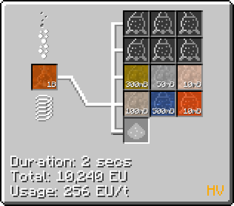
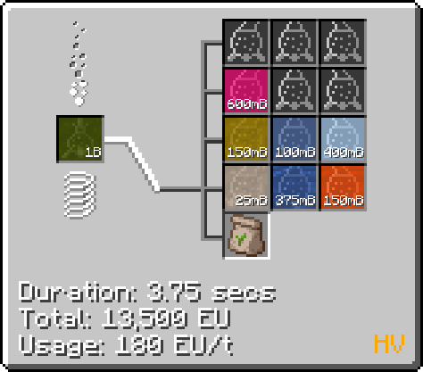
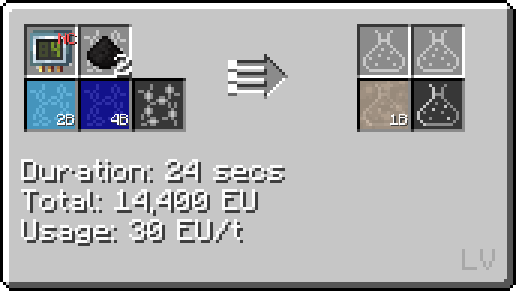
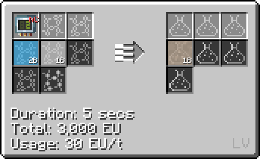
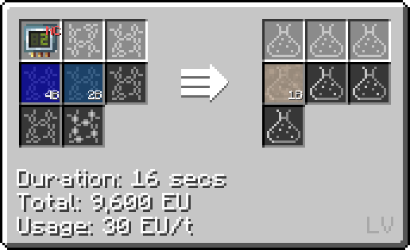
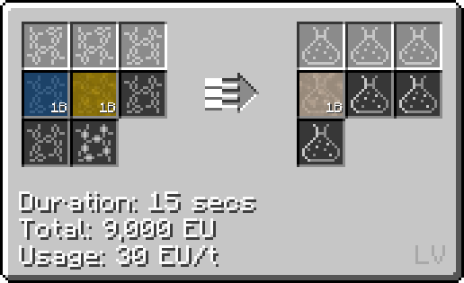

# Acetic Acid (C~2~H~4~O~2~)
<small>**Guide by:** humanoferth</small>

Acetic acid can be made as early on as <LV>**LV**</LV> and is used in a variety of lines and recipes. Notably, it's used in the production of [Polyvynil Butyral](/StarT-Wiki/Chemical-Lines/Plastics/Polyvinyl-Butyral/) and later on the production of polyimide.

## Making Acetic Acid

### Distillation

!!! example ""

    === "Fermented Biomass"
        This recipe takes fermented biomass and outputs a variety of organic materials, including a small amount of acetic acid.
        
        It can also be obtained from an <MV>**MV**</MV> distillery on circuit 1 with the same input.

        This should not be the method used to obtain any amount of acetic acid en mass since other methods are both faster and easier, though its still worth setting up for the other materials.
    === "Wood Vinegar"
        
        It can also be obtained from an <MV>**MV**</MV> distillery on circuit 1 with the same input.

        This method is better then using fermented biomass, as its easier to obtain wood vinegar from other distillations and from the pyrolose oven.

### Chemical Reactors

These recipes can use either regular or large chemical reactors. While they are faster than distillations, they do require that you have the reagents on hand or passived somewhere else.

!!! example ""

    === "Elements"
        This recipe takes carbon, hydrogen, and oxygen on circuit 4.
        
        This recipe is a good choice once you have the LCR and can take advantage of the perfect overclock. It's also only one step, which is a nice bonus.
    === "Ethylene + Oxygen"
        This recipe takes ethylene and oxygen on circuit 2.
        
        While this is a good recipe, ethylene has much better uses then for acetic acid. Keep in mind that while the recipe is <LV>**LV**</LV>, ethylene requires <MV>**MV**</MV> to make.
    === "Hydrogen + Carbon Monoxide"
        This recipe takes hydrogen and carbon monoxide on circuit 2.
        
        This recipe is faster then making it from its elements, though it does have a higher energy cost. It's also one of the few recipes fully availible in <LV>**LV**</LV>, though it's not worth making at that point since you don't have access to the [Formic Acid](docs/Chemical-Lines/Acids/Formic-Acid.md) Loop.
    === "Methanol + Carbon Monoxide"
        This recipe takes methanol and carbon monoxide and methanol on any circuit.
        
        This recipe is not as good as the hydrogen + carbon monoxide recipe, as methanol requires <MV>**MV**</MV> to make and by that point hydrogen + carbon monoxide is viable.

There are a couple more recipes for making acetic acid with chemical reactors, though they are not as useful as the ones previously described and should be avoided if at all possible:

- Reacting acetic anhydride and aminophenol.
- Reacting methyl acetate, water, and sodium hydroxide (sodium hydroxide is not consumed, requires <MV>**MV**</MV>).