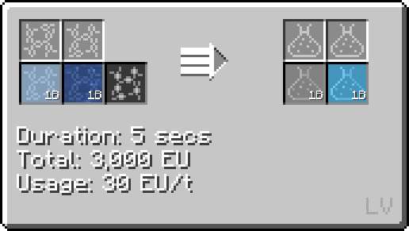

# Formic Acid

Formic acid is an acid available as early as <MV>**MV**</MV>. While it is not used in any major recipes, it is notable for its use in the formic acid loop, which takes in water and outputs hydrogen and oxygen.

## How to make Formic Acid

Formic acid is made from carbon dioxide (from liquid air distillation) and water.



## Formic Acid Loop

```mermaid
flowchart TD;
    %%{init: { 'theme': 'neutral', 'themeVariables': { 'edgeLabelBackground': 'transparent', 'secondaryColor': 'transparent', 'tertiaryColor': 'transparent', 'labelBkgBackground' : 'transparent' }}}%%

    A@{ img: "https://raw.githubusercontent.com/StarT-Dev-Team/StarT-Wiki/af90eac1ff73607dea361c0d1996524e6699f735/docs/Chemical-Lines/Acids/CH2O2_img/chemical_reactor_carbon_dioxide_from_carbon.png", label: "Chemical Reactor", pos: "t", w: 200, h: 200, constraint: "on" }

    B@{ img: "https://raw.githubusercontent.com/StarT-Dev-Team/StarT-Wiki/af90eac1ff73607dea361c0d1996524e6699f735/docs/Chemical-Lines/Acids/CH2O2_img/chemical_reactor_formic_acid.png", label: "Chemical Reactor", pos: "t", w: 200, h: 200, constraint: "on" }

    C@{ img: "https://raw.githubusercontent.com/StarT-Dev-Team/StarT-Wiki/af90eac1ff73607dea361c0d1996524e6699f735/docs/Chemical-Lines/Acids/CH2O2_img/electrolyzer_decomposition_electrolyzing_formic_acid.png", label: "Electrolyzer", pos: "t", w: 200, h: 200, constraint: "on" }

    D@{ shape: lean-r, label: "1b Water" }

    E@{ shape: lean-r, label: "1b Oxygen" }

    F@{ shape: lean-r, label: "2b Hydrogen" }

    D --> B;
    B --> E;
    C --> F;

    A --1b Carbon Dioxide--> B --1b Formic Acid--> C --1 Carbon Dust, 2b Oxygen--> A;
```

The Chemical Reactor can be substituted for the Large Chemical Reactor as well. This loop consumes much less power on top of being faster than electrolyzing water. Per two buckets of hydrogen and with all machines running at <MV>**MV**</MV>, the formic acid loop takes 8,960 EU over 5 seconds compared to 90,000 EU over 35 seconds. 