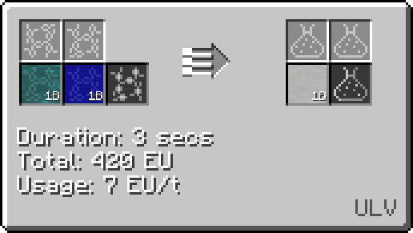
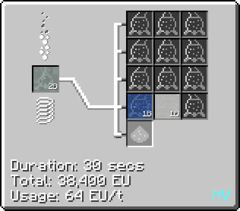

# Hydrochloric Acid

Hydrochloric acid available as early as <LV>**LV**</LV>, and has a wide range of uses as key component in the production of iron III chloride and cupric chloride (etching fluid), aqua regia (used in plat line), and as a part of many other recipes.

## Making Hydrochloric Acid

Hydrochloric Acid is made most simply by combining hydrogen and chlorine in a large / regular chemical reactor.

This recipe is the best way to produce large amounts of hydrochloric acid, as hydrogen can be obtained through the formic acid loop and chlorine can be obtained by electrolyzing salt. 

It is also a byproduct of a variety of recipes, including tetrafluoroethylene, platline (namely iridium processing), among others.

Hydrochloric acid also has a dilute form (dilute hydrochloric acid), which sometimes appears as a byproduct in certain reactions. This can be distilled back into hydrochloric acid and water in a distillery or distillation tower.

