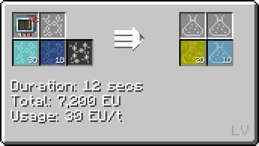
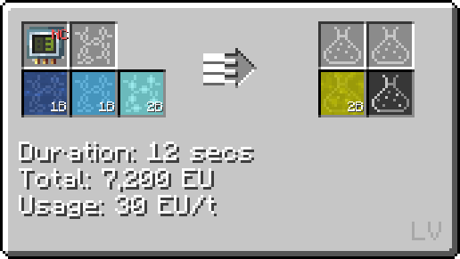
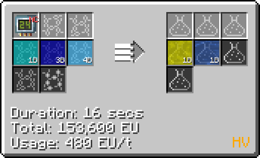
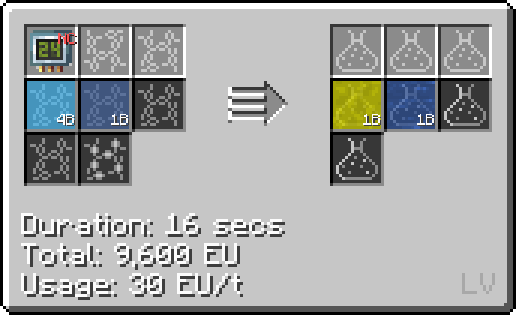

# Nitric Acid

Nitric Acid is availible as early as </LV>**LV**<LV> and has a few important uses, namely in the platline (both for aqua regia and processing purified ore) and nitration mixture (used in nitrobenzene production)

## Making Nitric Acid

Before attaining the Large chemical reactor, it can be made by combining nitrogen dioxide and oxygen on circuit 1, or the same two reagents plus oxygen on circuit 3.

 

Once the Large chemical reactor is unlocked, it can be made using the chemical skip by reacting hydrogen, oxygen, and nitrogen together on circuit 24.

It can also be made in the large chemical reactor using ammonia and oxygen on circuit 24. While this recipe is faster due to the lower voltage requirement, ammonia is also more difficult to come by.

Lastly, it is also the byproduct of a couple late game recipes.

<small><small>By: humanoferth</small></small>