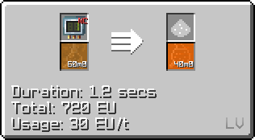

# Sulfuric Acid (H~2~SO~4~)
<small>**Guide By:** ME Item Storage Cell</small>

One of the first acids you'll ever make, and the first of many. Sulfuric acid  is mandatory in <mv>MV</mv> , as it is needed to create [Polyethylene](/StarT-Wiki/Chemical-Lines/Plastics/Polyethylene/), a basic plastic. However you can optionally make use of the acid in <lv>LV</lv> to make etching fluids.

## How to make Sulfuric Acid

This is the first way that you will make sulfuric acid

```mermaid
flowchart LR
    %%{init: { 'theme': 'neutral', 'themeVariables': { 'edgeLabelBackground': 'transparent', 'secondaryColor': 'transparent', 'tertiaryColor': 'transparent', 'labelBkgBackground' : 'transparent' }}}%%

    A@{ img: "https://start-dev-team.github.io/StarT-Wiki/Chemical-Lines/Acids/H2SO4_img/large_chemical_reactor_sulfur_dioxide_from_sulfur.png", label: "Chemical Reactor (LV)", pos: "t", w: 200, h: 200, constraint: "on" }

    B@{ img: "https://start-dev-team.github.io/StarT-Wiki/Chemical-Lines/Acids/H2SO4_img/large_chemical_reactor_sulfur_trioxide.png", label: "Chemical Reactor (LV)", pos: "t", w: 200, h: 200, constraint: "on" }

    C@{ img: "https://start-dev-team.github.io/StarT-Wiki/Chemical-Lines/Acids/H2SO4_img/large_chemical_reactor_sulfuric_acid_from_trioxide.png", label: "Chemical Reactor (LV)", pos: "t", w: 200, h: 200, constraint: "on" }

    D@{ shape: lean-r, label: "2b Oxygen" }

    E@{ shape: lean-r, label: "1b Water" }

    F@{ shape: lean-r, label: "1x Sulfur" }

    G@{ shape: lean-l, label: "1b Sulfuric Acid" }

    H@{ shape: lean-r, label: "1b Oxygen" }

    A --1b Sulfur Dioxide--> B --1b Sulfur Trioxide--> C

    D --> A
    F --> A
    E --> C
    C --> G
    H --> B
```

In <hv>HV</hv> , after obtaining the LCR, you can make use of its chemical skips to do it all in 1 recipe, as seen below. 


Later on, in <zpm>ZPM</zpm>, you can use the chemical plant instead.


You should definitely dedicate an LCR/Chem Plant to just making sulfuric acid. Having a dedicated storage (usually a fluid cell), is also recommended.

## Alternate sources
### Option 1: Hydrogen Sulfide

You can react Hydrogen Sulfide with Oxygen in the LCR easily get some Sulfuric Acid. Its a good supplementary source if you happen to have some extra lying around.


### Option 2: Smelting ores in the EBF for Sulfur Dioxide

There are a handful of ore dusts (Sphalerite, Pyrite, Galena, Stibnite, Tetrahedrite, Pentlandite, Cobaltite, Chalcopyrite), that when smelted in an EBF with Oxygen, produce a pure dust alongside Sulfur Dioxide. 


### Option 3: Recycling

Many recipes that uses sulfuric acid provide a byproduct, Diluted Sulfuric Acid. This liquid can be distilled to provide some of your Sulfuric Acid back, greatly reducing consumption. Don't bother using Distillation Tower. The only other byproduct is water, so be careful not to set your Distillery on the wrong circuit as well.



### Other options

There are a number of recipes that give sulfuric acid as byproducts. Not all of them are important or viable. A few examples of such recipes are:

- Sulfuric nickel solution electrolysis (See Platline)

- Triglycol Dichloride reaction

Among others. 