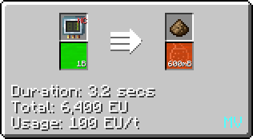
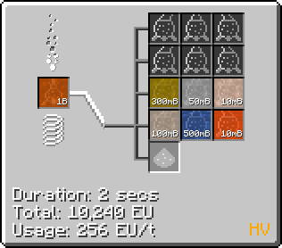
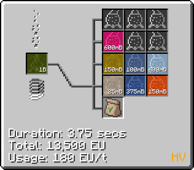
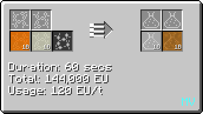
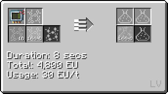
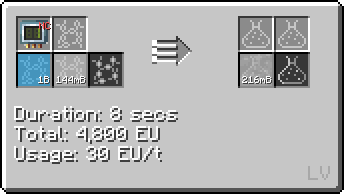

# Polyethylene (PE)
<small>**Guide By:** ME Item Storage Cell</small>

Polyethylene is the first plastic that you will make. Its main component is ethanol.

## How to make Polyethylene

### Ethanol

There are 2 ways to go about it, using either Create ethanol, or Gregtech ethanol. 

Create is good as an early game source, not requiring electricity, and easily automated with just a few pipes. However it doesn't scale very well (especially in terms of space). 

Thus if you find yourself running out of ethanol, it may be best to switch to the Gregtech method instead. Both guides will assume you have some source of sugarcane automation setup.


#### Create Ethanol

```mermaid
flowchart LR
    %%{init: { 'theme': 'neutral', 'themeVariables': { 'edgeLabelBackground': 'transparent', 'secondaryColor': 'transparent', 'tertiaryColor': 'transparent', 'labelBkgBackground' : 'transparent' }}}%%

    A@{ img: "https://start-dev-team.github.io/StarT-Wiki/Chemical-Lines/Plastics/PE_img/_createdieselgenerators_basin_fermenting_fermentable.png", label: "Create Basin (Lid on!)", pos: "t", w: 200, h: 200, constraint: "on" }

    B@{ img: "https://start-dev-team.github.io/StarT-Wiki/Chemical-Lines/Plastics/PE_img/composting_sugar_cane_2.png", label: "Thermal Composter", pos: "t", w: 200, h: 200, constraint: "on" }

    C@{ shape: lean-r, label: "Sugarcane" }

    D@{ shape: lean-l, label: "Ethanol" }

    B --Bonemeal--> A --> D
    C --> A
    C --> B
```

#### Gregtech Ethanol

!!! example ""

    === "Biomass"

        

        The main and most viable source of GT ethanol early game. There is no need to use the distillation tower at <hv>HV</hv>, as the only extra product is water.


    === "Wood Vinegar"

        

        You will most likely have this set up as a part of Charcoal byproduct distillation, around <ev>EV</ev>. While it isn't a direct source of ethanol, your demand would have gone down at this stage, so it's a good supplementary source.


    === "Fermented Biomass"

        

        Not worth setting up in <mv>MV</mv>, as it gives less ethanol than normal Biomass. But in <hv>HV</hv>, it does give other useful byproducts like methane in the Distillation Tower, so its really up to you if you set it up.


### Polyethylene

After obtaining Ethanol, it isn't much harder to get Polyethylene. 

First, you have to react [Sulfuric Acid](Chemical-Lines/Acids/Sulfuric-Acid/) with Ethanol to get Ethylene.



Then, you simply Polymerise it (Again in a chemical reactor), with either air or oxygen. 

!!! example ""

    === "Air"

        


    === "Oxygen"

        

        Oxygen gives higher yield, and there's really no reason not to use this recipe.

## Uses of Polyethylene

Polyethylene is used in various assembling recipes such as SMD components. 


Most commonly however, it is used as a sheet in <hv>HV</hv> and <ev>EV</ev> machine hulls.

<ev>EV</ev> Machine Hull


<hv>HV</hv> Machine Hull


