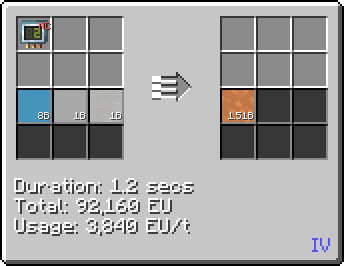
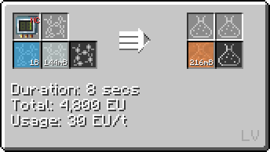
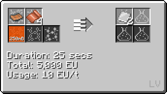
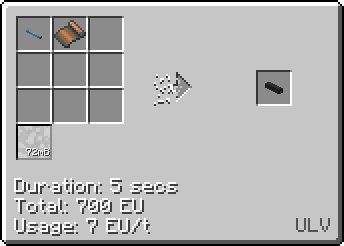

# Polyvinyl Chloride (PVC)
<small>**Guide By:** ME Item Storage Cell</small>

A plastic that you can optionally make in <mv>MV</mv>, immediately as you make Polyethylene. You can avoid making it until <ev>EV</ev>.

## How to make PVC

### Vinyl Chloride

!!! example ""

    === "Chlorine"
        ```mermaid
        flowchart LR
            %%{init: { 'theme': 'neutral', 'themeVariables': { 'edgeLabelBackground': 'transparent', 'secondaryColor': 'transparent', 'tertiaryColor': 'transparent', 'labelBkgBackground' : 'transparent' }}}%%

            A@{ img: "https://start-dev-team.github.io/StarT-Wiki/Chemical-Lines/Plastics/PVC_img/chemical_reactor_vinyl_chloride_from_chlorine.png", label: "Chemical Reactor (LV)", pos: "t", w: 200, h: 200, constraint: "on" }

            B@{ img: "https://start-dev-team.github.io/StarT-Wiki/Chemical-Lines/Plastics/PVC_img/electrolyzer_decomposition_electrolyzing_hydrochloric_acid.png", label: "Electrolyser", pos: "t", w: 200, h: 200, constraint: "on" }

            C@{ shape: lean-r, label: "1/2b Chlorine" }

            D@{ shape: lean-l, label: "1b Hydrochloric Acid" }

            E@{ shape: lean-r, label: "1b Ethylene"}

            F@{ shape: lean-r, label: "1b Chlorine"}

            G@{ shape: lean-l, label: "1b Hydrogen"}

            H@{ shape: lean-l, label: "1b Vinyl Chloride"}

            C --> A
            E --> A
            A --> D
            A --> H
            D --> B
            B --1b Chlorine--> A
            F --> A
            B --> G
        ```

        This is the recommended way to make Vinyl Chloride. You don't have to electrolyse the hydrochloric acid, you can simply use it. Recycling Chlorine isn't important, you more often than not have a surplus of it. 

    === "Oxygen + Hydrochloric acid"
        ```mermaid
        flowchart LR
            %%{init: { 'theme': 'neutral', 'themeVariables': { 'edgeLabelBackground': 'transparent', 'secondaryColor': 'transparent', 'tertiaryColor': 'transparent', 'labelBkgBackground' : 'transparent' }}}%%

            A@{ img: "https://start-dev-team.github.io/StarT-Wiki/Chemical-Lines/Plastics/PVC_img/chemical_reactor_vinyl_chloride_from_hydrochloric.png", label: "Chemical Reactor (LV)", pos: "t", w: 200, h: 200, constraint: "on" }

            C@{ shape: lean-r, label: "1b Oxygen" }

            D@{ shape: lean-r, label: "1b Hydrochloric Acid" }

            E@{ shape: lean-r, label: "1b Ethylene"}

            G@{ shape: lean-l, label: "1b Water"}

            H@{ shape: lean-l, label: "1b Vinyl Chloride"}

            C --> A
            E --> A
            D --> A
            A --> G
            A --> H
        ```

        Would not recommend using this method. It's much more straightforward to just use Chlorine. This method takes more machines energy, and resources (needs Oxygen and HCl inputs.). In <zpm>ZPM</zpm>, you can use a similar recipe in the Chemical Plant. It takes more materials, and is pretty slow, but it skips on polymerisation.

        


### Polymerisation

!!! example ""

    === "Air"

        

    === "Oxygen"

        

        ***Most efficient**

## Uses for PVC

You can optionally use PVC sheets to make plastics boards more efficiently.



However, you will need PVC in <ev>EV</ev>, to make aluminum cables for <ev>EV</ev> energy hatches. You will continue to use PVC from here on.

