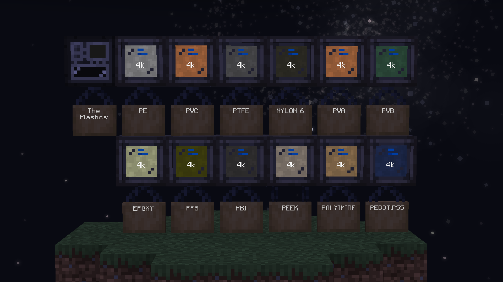

# Plastics
Plastics comprise a wide range of synthetic/semisynthetic materials composed primarily of polymers. Their most defining characteristic is their plasticity, that is, the ability to be molded, extruded, and pressed into a various amount of forms. 

Plastics are used to insulate cabling; the construction of busses, hatches, and casings; as well as in the assembly of numerous components later on.

As you progress up the voltage tiers, you unlock more and more complex and advanced plastics, used for things both new and old. You will often find that user higher tier plastics grant more yield, such as when covering cables.

## Extrusion

For streamlined use, plastics are usually solidified as an ingot, and then extruded into the desired shape (rods, foils, plates etc). This is not required in early game, but it does make it easier to pattern and automate these items when you gain access to AE2.

## Titanium Polymerisation

Most plastics need to polymerise (where the poly part of the name comes from). Usually, this step requires either air or oxygen, with oxygen providing higher yield. You can also use Titanium Tetrachloride for extra yield. Using oxygen is often always enough, and you should be using Titanium Tetrachloride for Titanium.

